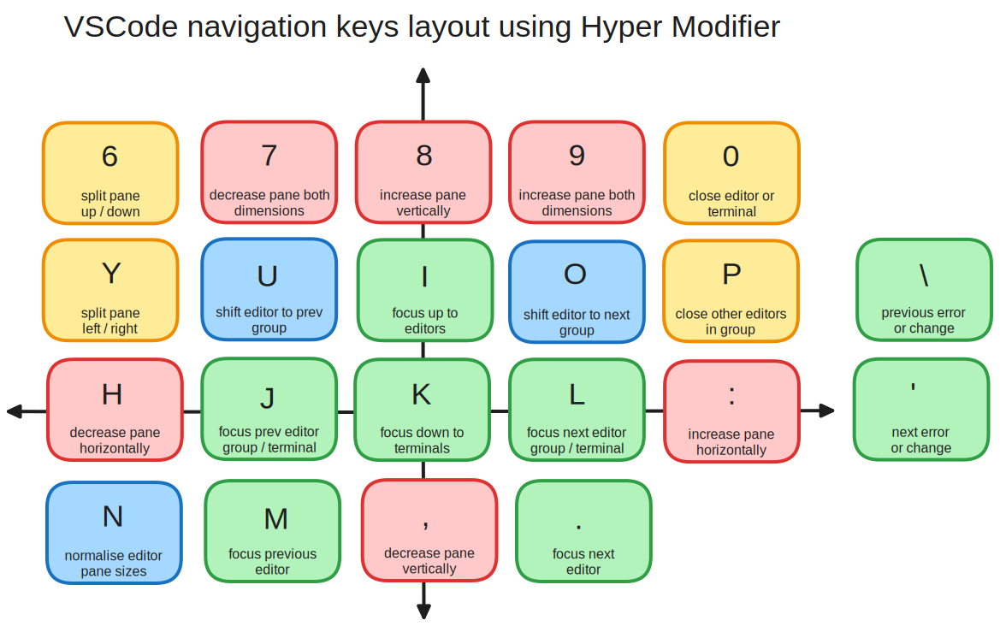
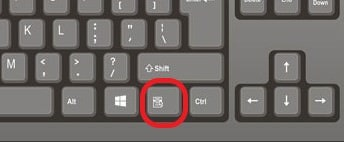

Work Faster in VSCode Without Needing a Mouse
=============================================

Introduction
------------

Every few years I have a go at learning to use my IDE without a mouse. I've
put hours of effort in and always failed. That is until I purchased a
[ZSA Voyager keyboard](https://www.zsa.io/voyager/) a couple of weeks ago.

In this post I'll explain how I have achieved this and provide details on how
you can do the same. Although I'm using the Voyager, these tips will work for
many keyboards, but you will get the best results with a keyboard that is:

- programmable, preferably with [QMK](https://qmk.fm/) or [ZMK](https://zmk.dev/)
- [ortholinear](https://www.howtogeek.com/70291/what-is-an-ortholinear-keyboard-and-should-you-use-one/)

Why the Voyager
---------------

There are a few things that the voyager brings that have helped achieve
(near) zero mouse use in VSCode.

- The compact, ortholinear layout lets you feel your way around easily,
  never have to stretch your hand and never loose the home keys.
  Therefore you never need to look away from the monitor.
- The ability to program a hyper key means that you can assign a bunch of
  vscode keybindings without constantly clashing with other keybindings.
- Finally, you can program the keyboard to operate as a mouse so that for minor
  mouse use where you have failed to bind or remember a function you can still
  keep your hands in place.

Hyper Key Bindings
------------------

Having a single key to press *ALL* the modifier keys simultaneously allows for
creating a set of keybindings that do not clash with any existing keybindings
in VSCode, there are so many keybindings that it is always hard to create a
useful scheme without finding you have overridden an essential feature.

I have programmed a hyper key under the left thumb and then assigned all of the
right hand to features that navigate between panes and arrange panes. These
functions are the most common ones for which the mouse is usually used.

The ortholinear layout allows for a relatively intuitive placement of these
functions. Here is an image to help remember the placement:

The necessary vscode keybindings to go with this layout can be downloaded from
here: [keybindings.json](keybindings.json). You should merge this file into
your user keybindings file, use the menu command
File > Preferences > Keyboard Shortcuts to open yours. These bindings are
guaranteed not to clash with existing ones and they don't delete any exiting
bindings.

One problem with trying to memorize the default bindings is that there are
separate functions for similar operations. e.g. `next error` in a code editor
and `next change` in a Working Tree editor. Where possible I have used a
single keybinding to multiple functions, chosen by the context.

Other Useful Keys to Remember
-----------------------------

In order to complete the transition to mouse-free use, I created a list
of the remaining useful functions that have relatively accessible default
keybindings.

This section will not be useful for those that love Vim or some other non
default scheme. For someone who likes the defaults or who has never changed
them, like me, this list may come in handy. I took a poll of fellow VSCode
users and many of these were not widely known.

## Keyboard Configuration

Some bindings below have multiple modifiers. These are good candidates
for programming into your keyboard. I have done this in my Voyager config,
for those combinations using `alt` `shift`.
See my config [here](https://configure.zsa.io/voyager/layouts/pDAzE/WOLZj/0)

It is a great idea to have the Application Key configured. This will give
you the context menu like right mouse click on the currently focused item.

On standard keyboards it looks like this:

## Breadcrumbs

This deserves its own heading as it is such a useful way to navigate all
the folders in your workspace and all the code sections within each file.

| Key | Action |
| --- | ------ |
| `ctrl shift` `.` | Focus breadcrumbs |
| `↓` `↑` `→` `←`| Navigate breadcrumbs |
| `space` | Open current file or jump to current section |

## Selection management - especially multi cursor

| Key | Action |
| --- | ------ |
| `alt shift` `→` | Expand selection |
| `alt shift` `←` | Shrink selection |
| `alt shift` `i` | add cursors to end of all selected lines (the 2 below can easily do cursors on start)
| `ctrl` `↓` | Add a cursor below |
| `ctrl` `↑` | Add a cursor above |
| `ctrl` `⏎` | Add all found words to selection |
| `ctrl` `d` | Add current word / next matching word to selection |
| `ctrl` `d` | Add current word / next matching word to selection |
| `ctrl` `u` | undo last selection / cursor motion |

e.g. to add '-world' to all instances of 'hello':

- move cursor one of the 'hello',
- `ctrl` `f`
- `alt` `⏎`
- `→` (deselects all 'world' and places the cursors at the right end of each)
- -world

## Navigating the Explorer

And other tree views like search results, git history, etc.

To get focus on these - see Hyper Key Bindings above.

| Key | Action |
| --- | ------ |
| `↓` `↑` `→` `←`| Navigate (shift for multi-select) |
| `letter` | jump to next file starting with  letter |
| `shift letter` | jump to previous file starting with letter |
| `space` | open the current file in a preview editor, keep explorer focus |
| `enter` | open all selected files editors |
| `ctrl` `enter` | open current file in a new editor |
| `alt` `enter` | open current file in a preview editor |
| `F2` | rename current file |
| `Application Key` | Context Menu |

## Navigating code

See Hyper Key Bindings above for navigating changes / errors.

| Key | Action |
| --- | ------ |
| `F12` | Jump to definition |
| `Application Key` | Menu for ALL code inspection options |

## Terminals

See Hyper Key Bindings above for splitting and resizing terminals.

| Key | Action |
| --- | ------ |
| `ctrl shift`  `` ` `` | Open new terminal (back tick) |
| `ctrl page` `up`/`down` | Switch to prev / next Terminal Group |
| `ctrl` `↑` / `↓` | Scroll to previous / next command input |
| `ctrl shift` `↑` / `↓` | Move SELECTION to previous / next command output |
| `ctrl shift` `C` / `V` | Copy / Past SELECTION |

To get a terminal command output into an editor window:

- Select the one you want with ctrl arrows and ctrl shift arrows.
- `ctrl shift` `C` to copy
- `ctrl` `1` switch to fist editor group
- `ctrl` `n` for new window
- `ctrl` `v` to paste

Above is a good candidate for a keyboard macro if you have such a capability.

## Menus

| Key | Action |
| --- | ------ |
| `alt` | Show menu bar |
| `alt shift` `O` | Open Remotes / Dev Containers menu |

## Don't Forget

Every single command is available via the command palette `ctrl` `shift` `P`.
Its really useful for the obscure things like - closing all the pop up
notifications which has no default key binding. It's also great if you forget
a keybinding as it will remind you of the binding when you find the command.

Summing Up
==========

Have I really stopped using the mouse altogether? Not quite, I certainly still
reach for it when switching to a browser. I also don't find the selection
of text in VSCode terminals that consistent. It is almost brilliant, but falls a little
short, but that is now the only time I still use the mouse within VSCode.

This has been a huge change for me, my workflow feels significantly smoother and
faster.

I'm going to continue on this journey of keyboard skills improvement and you
can track updates to my notes
[here](https://github.com/gilesknap/zsa-voyager-vscode) if interested.
